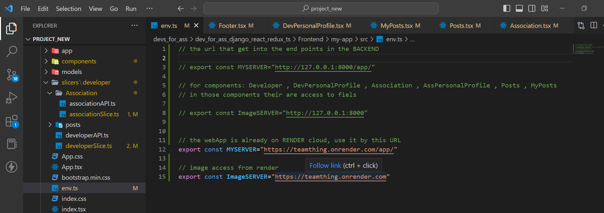

# Developer for humnity
# Introduction
This project was created with the aim of combining the different communities in our country and helping people reach each other.

### The goal:
 to connect developers with associations that need technological help such as building a website
### It contains:
  A user of a developer who can introduce himself to the market
A user of an association that can introduce itself to the market and in addition create posts with its technological needs

# importanat note:
on .env file at REACT the server is RENDER
if you want to change to yours local host computer Lines 3 and 8 should be removed from the comment && 
Lines 12 and 15 put in a comment


# Technologies Used
- Django
- Django Rest Framework API
- React-Typescript
- React-Redux
- PostgreSQL
- Render

# Pre-requisites
Please ensure you have the following installed on your local machine: 
- [Python 3.x]((https://www.python.org/downloads/))
- [Node.js and npm](https://docs.npmjs.com/downloading-and-installing-node-js-and-npm)
- [pip]((https://www.geeksforgeeks.org/how-to-install-pip-on-windows/))
- [Django](https://docs.djangoproject.com/en/4.1/topics/install/)
- [Django Rest Framework](https://www.django-rest-framework.org/#installation)
- [React](https://reactjs.org/docs/create-a-new-react-app.html)
- [Redux](https://redux.js.org/introduction/installation#create-a-react-redux-app)

In the event where the pre-requisites aren't being met, please follow the links listed and proceed with the installations. 

**The proccess is identical between Windows and Mac.**

<br>

# Step-by-step Tutorial

1. download the project from GitHub by the comment:
```
git clone https://github.com/shirepsh/devs_for_ass.git
```

2. install virtualenv
```bash 
pip install virtualenv
```
4. open venv named venv
```bash
python -m virtualenv venv
```
5. get into the venv 
```bash
venv\Scripts\active
```
6. install all the right packages with the requirements file
```bash
pip install -r requirements.txt  
``` 
7. run the application by the comment:
```
py manage.py runserver
```
8. create superuser at the terminal (give name, email, password)
```
py manage.py createsuperuser    
```
9. run the server again

10. open another terminal & connect between thw two , by the following button


```
cd Fronted
```
9. install all the installations are required
```
npm i
```
10. get into the react application
 ```
 cd my-app
 ```
11. run the app
```
npm start
```

# Existing Features
- Login + Register AS developer & As association
- create profile with upload image
- edit / delete profile
- add / delete post 

## Code Author

- [Shir Epshtain](https://www.linkedin.com/in/shir-epshtain/)


